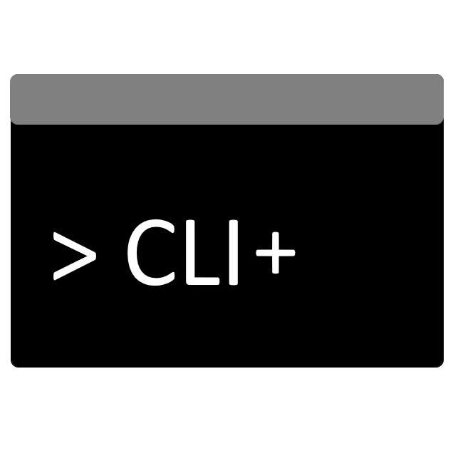

# Additional CLI commands for Shopware 6



## About this plugin

When installing and managing Shopware instances, especially when using Ansible for configuration management, a lot of crucial CLI commands are just plain MISSING. This project is intended for learning purposes and for having others participate from my learning.

Developing with Docker image (like [shyim/shopware](https://hub.docker.com/r/shyim/shopware/)), which is often used for production environments.

Initialized via (but modified afterwards):
```sh
docker compose run --rm -it --entrypoint /usr/bin/sudo shopware -E -u www-data php /var/www/html/bin/console plugin:create --create-config DynamicFilesCLIAdditions
```

## Important note

This is a learning project (which is not yet published)! If you want to use it, use it at your own risk!

## Compatibility

Should work on Shopware version `6.5.x` and `6.6.x`. Does **not** work on `6.4.x` due to Shopware plugin changes of `EntityRepository`.

## Provided commands

```
Available commands for the "cli-additions" namespace:
  cli-additions:rules:get-id                            Get ID of rule with given name.
  cli-additions:rules:list                              List all available rules.
  cli-additions:system:acl-roles:list                   List all available user roles.
  cli-additions:system:acl-roles:list-role-permissions  List all permissions for given user role.
  cli-additions:system:skip-first-run-wizard            Marks the FirstRunWizard (FRW) as already executed.
  cli-additions:system:usage-data:accept                Accept the terms and enable system usage data sharing.
  cli-additions:system:usage-data:revoke                Revoke/Decline the terms for system usage data sharing.
  cli-additions:system:usage-data:skip-for-user         Skip the usage data sharing request for given user.
```


## Dev-Setup
Some commands I am using while development after `docker compose up`:

### Install and activate plugins
```
docker compose run --rm -it --entrypoint /usr/bin/sudo shopware -E -u www-data php /var/www/html/bin/console plugin:install DFCLIAdditions
docker compose run --rm -it --entrypoint /usr/bin/sudo shopware -E -u www-data php /var/www/html/bin/console plugin:activate DFCLIAdditions
```

### Skip that nasty First-Run-Wizard
```
docker compose run --rm -it --entrypoint /usr/bin/sudo shopware -E -u www-data php /var/www/html/bin/console system:config:set core.frw.completedAt "2024-03-01T12:00:00+00:00"
```
or
```
docker compose run --rm -it --entrypoint /usr/bin/sudo shopware -E -u www-data php /var/www/html/bin/console cli-additions:system:skip-first-run-wizard
```

## Knowhow
https://symfony.com/doc/current/service_container/debug.html
```
docker compose run --rm -it --entrypoint /usr/bin/sudo shopware -E -u www-data php /var/www/html/bin/console debug:container
```

```
docker compose run --rm -it --entrypoint /usr/bin/sudo shopware -E -u www-data php /var/www/html/bin/console cli-additions --help
```
